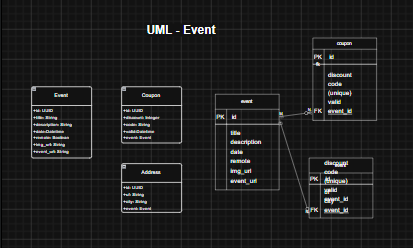

# Backend TecEvents

## 目的

テクノロジー系イベントを管理するアプリケーションのバックエンドを開発すること。イベントの登録、一覧表示、フィルタリング、および詳細、表示を可能にし、さらに割引クーポンの関連付けを行う。

Desenvolver o backend de uma aplicacao para gerenciar eventos de tecnologia, permitindo o cadastro, listagem, filtragem e detalhamento de eventos, bem como a associacao de cupons de desconto.

## 詳細

[] O sistema deve permitir que o usuario cadastre um evento com os seguintes campos:

- Titulo (obrigatorio)
- Descricao (opcional)
- Data (obrigatorio)
- Local(obrigatorio, se presencial)
- Imagem (opcional)
- URL do evento (obrigatorio se remoto)

[] Eventos podem ser classificados como remotos ou presenciais.

[] O sistema deve permitir que o usuario associe um ou mais cupons de descontp a um evento.
Cada cupon deve possuir os seguintes campos:

- Codigo do cupon (obrigatorio)
- Desconto percentual ou valor fixo (obrigatorio)
- Data de validade (opcional)

[] O sistema deve listar os eventos cadastrados com paginacao.
A listagem deve incluir:

- Titulo
- data
- Local
- Tipo (remoto ou presencial)
- Banner
- Descricao

[] O sistema deve retornar somente eventos que ainda nao aconteceram.

[] O sistema deve permitir que o usuario filtre a lista de eventos pelos seguintes criterios:

- Titulo
- Data
- Local

[]  O sistema deve permitir que o usuario consulte todos os detalhes de um evento especifico, incluindo:

- Titulo
- Descricao
- Data
- Local
- Imagem
- URL do local

---

